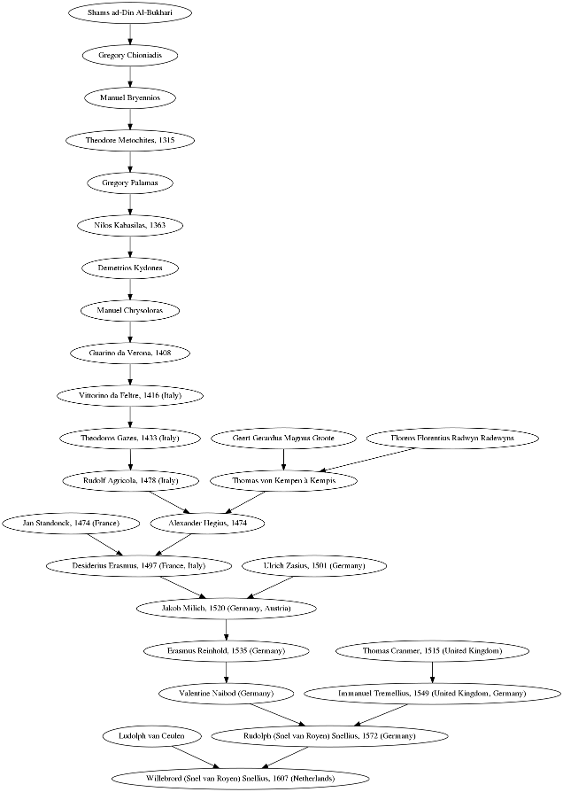

Build PhD Genealogy Tree
========================

Have a PhD in maths or computer science? Find out if Euler or Leibniz are among your academic ancestors by building your academic genealogy tree!

This Ruby script calculates and fetches the transitive closure of academic ancestors (advisors from PhD theses) with data from [genealogy.math.ndsu.nodak.edu](http://genealogy.math.ndsu.nodak.edu). It visualizes the resulting tree using GraphViz dot.

Example
=======
Here is an example for [Willebrord Snellius](https://en.wikipedia.org/wiki/Willebrord_Snellius):



How to use
==========
We provide two functions to generate a genealogy tree. One just retrievs and plots information from the Mathematics Genealogy Project, you supply it with the id of that person, as such:

```
create_ancestry_graph "id.php?id=125302"
```

The other one allows one to add a leaf entry which is not (yet) in the database. This is helpful when wanting to present young doctors with a tree which includes them directly after their defense. The function can take from one to three advisors.

```
create_ancestry_graph_add_leave_student(Person.new('Moritz Beller', 'Netherlands', '2018'), 'id.php?id=71273', 'id.php?id=134422', 'id.php?id=144358')
```

**Do not forget to submit an update to the Mathematics Genealogy Project.**