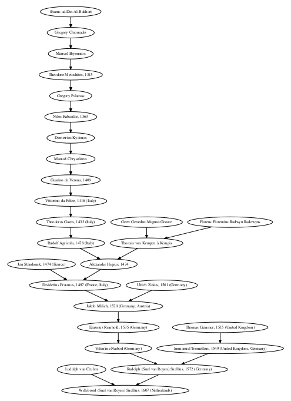

Build PhD Genealogy Tree
========================

Have a PhD in maths or computer science? Find out if Euler or Leibniz are among your academic ancestors by building your academic genealogy tree!

This Ruby script calculates and fetches the transitive closure of academic ancestors (advisors from PhD theses) with data from [genealogy.math.ndsu.nodak.edu](http://genealogy.math.ndsu.nodak.edu). It visualizes the resulting tree using GraphViz dot.

